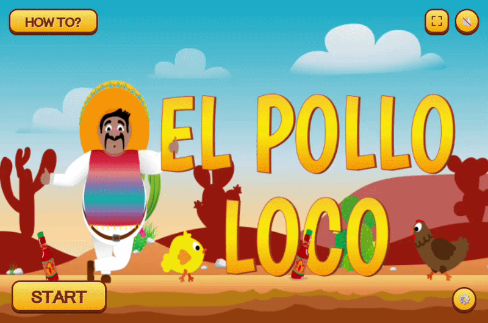

# El Pollo Loco


A browser-based 2D side-scrolling platformer built from scratch with **vanilla JavaScript** and the **HTML5 Canvas API** - no frameworks, no game engine, no build tools. Created as a portfolio project during my Fullstack Web Development training at the [Developer Akademie](https://developerakademie.com/).

**[▶ Play it live](https://maxbelich.developerakademie.net/EL_Pollo_Loco/index.html)**



## About

Help Pepe cross the desert, defeat the chickens standing in his way, and take down the Endboss - a giant chicken - by throwing salsa bottles at it. Collect coins to buy more bottles, keep an eye on your health, and don't get pecked to death before you reach the end of the level.

## Features

- Player character with idle, walking, jumping, hurt and death animations
- Two enemy types (regular & small chickens) defeated by jumping on them
- Full endboss fight with alert, attack, hurt and death states
- Throwable salsa bottles as the main ranged attack
- Collectible coins and bottles, including a coin-for-bottle trade mechanic (`Q` key / mobile button)
- Four live status bars (health, coins, bottles, endboss health)
- Parallax-scrolling background and camera
- Start screen, win/lose screen with restart & home options
- Full sound design with a volume control and mute toggle
- Responsive layout with on-screen touch controls, fullscreen mode, and portrait-mode warning for mobile

## Controls

| Action | Key |
| --- | --- |
| Move | `←` `→` / `A` `D` |
| Jump | `↑` / `W` / `Space` |
| Throw bottle | `E` |
| Trade 5 coins for a bottle | `Q` |

On touch devices, on-screen controls appear automatically.

## Tech Stack

- **Vanilla JavaScript (ES6 classes)** - no frameworks or libraries
- **HTML5 Canvas API** for rendering and the game loop
- **CSS3** with media queries for responsive/mobile layout
- No build step - plain static files, deployable as-is
- Fully documented with **JSDoc** on every class and method

## Architecture

The game is built around a classic OOP inheritance chain, with all game objects extending a common drawable/movable base:

```
DrawableObject
└── MovableObject
    ├── Character (Pepe)
    ├── Chicken / ChickenSmall
    ├── Endboss
    ├── Cloud
    ├── BackgroundObject
    ├── ThrowableObject
    └── CollectibleObject
```

Alongside these sit a few standalone manager classes:

- `World` - the central game loop, drawing, and overall game state
- `Level` - holds a level's enemies, clouds, background and items
- `CollisionManager` - all collision, damage and pickup logic
- `SoundManager` - playback, looping music, mute/volume
- `Keyboard` - tracks pressed/released control keys
- `StatusBar` - renders the health/coin/bottle/endboss bars

The Developer Akademie's project checklist required every file to stay under ~400 lines and every function to stay short and single-purpose. Sticking to that meant, for example, pulling all collision, damage and pickup logic out of the growing `World` class into its own dedicated `CollisionManager` once `World` got too large.

A visual class diagram is available at [`docs/class-diagram.drawio`](docs/class-diagram.drawio) - [open it directly in draw.io](https://app.diagrams.net/#Uhttps%3A%2F%2Fraw.githubusercontent.com%2Fmaxbelich%2FEL-Pollo-Loco%2Fmain%2Fdocs%2Fclass-diagram.drawio).

### Project structure

```
index.html         Game entry point
impressum.html     Legal notice
classes/           All game classes (see above)
js/main.js         Bootstrap, UI wiring, keyboard/touch input
levels/level1.js   Level 1 definition
assets/            Sprites, audio, fonts
style/             CSS (base, responsive, fonts, impressum)
docs/              Class diagram
```

## Getting Started

No build step required - it's plain HTML/CSS/JS.

```bash
git clone https://github.com/maxbelich/EL-Pollo-Loco.git
cd EL-Pollo-Loco
```

Then just open `index.html` in a browser, or serve the folder with any static server (e.g. the VS Code "Live Server" extension) to avoid browser restrictions on local file access.

## What I Learned

This was my first larger object-oriented JavaScript project, and it taught me a lot beyond just "making a game work":

- **Object-oriented JavaScript**: designing a class hierarchy (`DrawableObject → MovableObject → ...`) with real inheritance and shared behavior, instead of one big procedural script
- **Building a game loop from scratch**: Canvas rendering, sprite-based animation via `setInterval`, and keeping movement, physics and rendering in sync
- **Collision detection & game state**: handling player/enemy/collectible/endboss interactions and win/lose conditions cleanly in a dedicated `CollisionManager`
- **Audio management**: coordinating multiple simultaneous sound effects plus looping background music with mute/volume control
- **Responsive game design**: adapting a fixed-size canvas to mobile screens, adding touch controls, and handling orientation changes
- **Refactoring for maintainability**: splitting logic out of a growing `World` class once it got too large, and keeping files/functions small and readable
- **Git workflow**: working with feature branches and pull requests even as a solo developer, to practice a professional review workflow

## Credits & License

This is a private, non-commercial portfolio project. Character/enemy sprites were provided by the Developer Akademie as part of the training. Full music and sound credits are listed in the in-game [Impressum](impressum.html).
